[English](README.md) | [Français](README.fr.md)

# LightX Workspace


-orange>)


[](https://crates.io/crates/lightx)
[](https://docs.rs/lightx)

**LightX** is a hyper-optimized, production-grade Rust macro-framework. It pioneers a strict **Database-First** approach and a **Zero-Overhead** philosophy.

Instead of writing repetitive code, LightX securely introspects your MySQL database and mathematically constructs your entire backend (Models, Routers, and Validation Interceptors) at compile-time.

---

## Workspace Architecture

Here is how the LightX ecosystem is organized as a Cargo workspace:

```text
lightx-workspace/
├── lightx/                 # The core Engine (macros, generators, HTTPS server)
│   ├── src/                # Core networking, databus, and validation logic
│   └── assets/             # Technical architecture SVG diagrams
│
├── lightx-test/            # The showcase Starter Kit (Living documentation)
│   ├── handlers/           # TOML orchestration files
│   ├── migrations/         # SQL database schemas
│   └── src/                # Auto-generated DAOs & Manual Business Objects
```

_Note: If you are a novice looking to learn how to build apps with LightX, we strongly recommend exploring `lightx-test`!_

---

## The 3 Core Pillars of LightX

To understand LightX, you only need to understand three isolated layers:

<div align="center">
  
</div>

### 1. DAO (Data Access Object)

Automatically generated by traversing your SQL Database. It writes pure Rust structs directly into the compiler's memory for perfect type-safety and Zero git bloat. You never write a raw SQL query again.

### 2. AOP (Aspect-Oriented Programming)

Your API endpoints are mapped using simple `.toml` files (e.g. `handlers/AdminCreation.toml`). The runtime reads them at compilation and generates rigorous **Fail-Fast** validators (in O(1) complexity) to prevent fraudulent data from getting in.

### 3. BO (Business Object)

Where your engineers write their logic. Protected tightly by the AOP firewall, your business code only ever manipulates valid, clean, and fully-typed payloads.

---

## Fail-Fast Error Propagation (Panic-Free)

<div align="center">
  
</div>

LightX is designed to never crash. All runtime panics (`unwrap()`) are rigorously banned from the generated logic.
Any validation parsing error (`400 Bad Request`), missing endpoint (`404`), or business rule violation (`422`) natively maps to an i18n JSON payload:

```json
{
  "code": 422,
  "field": "email",
  "error": "Only @lightx.com domains are allowed."
}
```

## Request Lifecycle (Pedagogical Overview)

To understand LightX, you must distinguish the automatic code generation magic from the actual code written by the developer.

### Generated vs Manual Layers

- **Generated Layers (Machine):** The **Router (Core)** (which parses the HTTP URL), the **`check_parameters`** validator (which casts types and checks data integrity from DB rules), the **Handler (AOP)** (which orchestrates fail-fast calls), and the **DAO** (which executes safe SQL queries).
- **Manual Layers (Human):** The **Configuration Files (`.toml`)** and the **Business Objects (BO)**, where you write the core intelligence of your application (your business logic).

### Detailed End-to-End Flow

1. **The HTTP Request:** The client sends a `POST /api/users`.
2. **The Router (Core) & Validation:** The high-speed router finds the exact path in `O(1)`. It immediately calls `check_parameters` to verify the payload (e.g., "is the email > 5 characters? formatted correctly?"). If invalid, it short-circuits and returns an `HTTP 400 JSON`. Nothing hits the DB.
3. **The Handler (AOP):** Your payload is perfectly safe. The Handler then orchestrates the sequential execution of your _Business Objects (BO)_ through a fail-fast validation phase, followed by a transaction processing phase.
4. **The BO (Business Object):** This is the only function YOU write. It securely pulls the purely typed and validated data from memory, applies your logic (e.g., tax calculations, business assertions), and calls the data objects.
5. **The DAO:** If your BO needs DB interaction, the DAO _lazily_ opens a networking connection to the database and talks strictly via compile-time validated SQL.
6. **The Response:** The framework automatically commits the SQL transaction, elegantly serializes the return data as an `HTTP 200 OK` (JSON or HTML response). If any cascade failure happened, a RAII destructor automatically manages the DB Rollback.

### What should the developer actually do?

To create a brand new API Endpoint from scratch with LightX, a developer only follows **4 simple steps**:

<br>
<div align="center">
  
</div>
<br>

1. **The Database (SQL):** Add your table to your SQL database (e.g., `users` table). The Code Generator safely introspects the base constraints (creating `.toml` data dictionaries inside `schema/`).
2. **Overrides & Virtual Parameters (TOML):** Since data is generated automatically, what about non-database fields? You manually write `TOML` files in the `overrides/` folder to either _override_ an existing DB column rule (e.g., set `min_length = 8` for a password) or forge entirely **Virtual Parameters** (e.g., `password_confirmation` or `accept_terms`).
3. **The Route (TOML):** Declare your handler orchestration in `handlers/RegisterUser.toml`, map the expected fields (from both DB and Virtuals), and write the sequence of `BO` it should execute.
4. **The Logic (Rust):** Create a basic file in your BO folder (e.g., `src/bo/user_bo.rs`), write an async function accepting the unique `&mut RequestContext`, script your logic, and run `UserDao::insert...`. Finally, hit `cargo run`!

## Compiling the entire workspace

If you want to compile both the engine and the test suite at the exact same time, you can run the following command directly from this root folder:

```bash
cargo build
```
