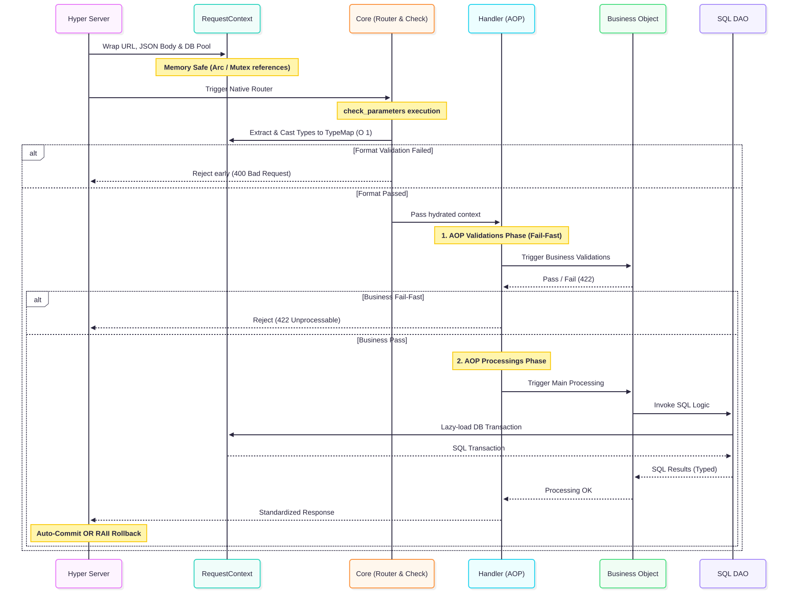

[English](README.md) | [Français](README.fr.md)

# Librairie Cœur LightX


Bienvenue dans le moteur interne du **Framework LightX** !

Si vous êtes un développeur backend en train d'utiliser LightX pour créer votre application (par exemple depuis le dossier `lightx-test/`), vous n'aurez pratiquement jamais besoin de toucher au code de ce dossier !

Ce répertoire (`lightx/`) constitue le "moteur sous le capot". Il abrite la logique des macros Rust, les générateurs de code automatiques, et notre propre serveur web HTTP embarqué qui transforme vos simples fichiers TOML en code natif surpuissant tournant à la vitesse de l'éclair.

## Que fait concrètement cette librairie ?

<div align="center">
  
</div>

1. **Les Générateurs de Code (`core_generator.rs`, `handler_generator.rs`, `dao_generator.rs`)**
   À chaque compilation (`cargo build`), ces fichiers agissent comme vos assistants personnels. Ils lisent votre base de données et vos fichiers de configuration, et rédigent automatiquement des milliers de lignes de code fiables pour vous (telles que vos Structures de base de données ou la logique des routes HTTP).
2. **Le Serveur Web (Hyper & Rustls)**
   LightX intègre directement son propre serveur multi-thread ultra-rapide. Il gère nativement la sécurisation HTTPS (TLS) et redirige même automatiquement le trafic HTTP vulnérable, vous évitant de devoir configurer des serveurs Nginx ou Apache complexes !

3. **Le `RequestContext` (Le bus de données)**
   Quand un utilisateur vous envoie une requête, LightX emballe tout (Les données web, le corps JSON, la connexion à la BDD sécurisée) dans un grand colis mémoire appelé `RequestContext`. C'est cet objet que vous manipulerez tous les jours dans vos fonctions "Métiers" sans jamais risquer de fuite mémoire.

<br>
<div align="center">
  
</div>
<br>

### Le Flux Détaillé d'Exécution (De Bout en Bout)

Bien que la génération de code soit complexe, le cycle de vie d'une requête HTTP générée par LightX repose sur des composants très stricts qui s'emboîtent séquentiellement :

1. **Le Routeur (Core) & Validation :** Le serveur HTTP intercepte la requête et l'Aiguilleur natif (Core) l'inspecte en un temps `O(1)`. Il exécute ensuite sa fonction générée `check_parameters` pour valider l'intégrité de la donnée via les schémas, et procède au _cast_ (typage strict).
2. **Le Handler (AOP) :** Totalement généré, il agit en tant qu'orchestrateur. Il déroule l'exécution des _Business Objects (BO)* selon deux grands groupes configurés en TOML : les validations (pures) puis les traitements (sécurisés par transaction).
3. **Le BO (Business Object) - _Code Manuel_ :** Le cœur du métier de l'application ! Le code manuel écrit par le développeur prend le relais. Il applique les algorithmes métiers sur des données 100% fiables, pures, et sollicite les DAO si nécessaire.
4. **Le DAO - _Généré et Manuel_ :** S'il y a des écritures en BDD, le DAO généré ouvre paresseusement (lazy load) une connexion réseau et exécute des requêtes SQL fortement typées.
5. **Le Retour (Réponse HTTP) :** Dès que le BO a terminé, l'AOP reprend la main. Si un succès remonte, le Core émet un `COMMIT` SQL. Sinon, la moindre erreur entraine l'exécution du destructeur formel (RAII) et déclenche un `ROLLBACK` automatique.

### Couches Générées vs Couches Manuelles

LightX instaure une scission parfaite entre l'humain et la machine :

- **Couches 100% Générées (La Machine) :** Le Serveur HTTP, le Routeur, le filtre `check_parameters`, les `Handlers` (AOP), et la machinerie interne des `DAO`.
- **Couches 100% Manuelles (L'Humain) :** Vos fichiers descripteurs `.toml` (Dictionnaire BDD et Schémas AOP), et vos fonctions Rust `BO` (Business Objects).

## La promesse "Panic-Free" (Zéro Plantage)

Si vous parcourez le code source dans `src/`, vous remarquerez une règle architecturale sacrée :
**Nous n'autorisons JAMAIS l'utilisation de `unwrap()` ou `panic!()` dans nos systèmes de validation.**

Si un utilisateur envoie des données totalement corrompues, ou que la base de données vacille, le moteur LightX est conçu pour étouffer le crash et le métamorphoser gracieusement en un joli message d'erreur JSON standardisé pour le Frontend. Le serveur ne plantera jamais.

## L'Architecture "Zéro Superflus" (Pureté de Production)

LightX refuse formellement de polluer vos serveurs. Nous offrons une stricte isolation des comportements :

- **Zéro Code de Test en Production**: Absolument tous les modules de Mocking (`SuperTest`), les stubs d'API, et les dossiers d'acharnement réseaux (Fuzz Testing) sont bannis et isolés de force hors du moteur natif. Votre exécutable de production garantit une pureté absolue et mathématique.
- **Context Factory Dynamique**: Les pools de connexions de LightX sont compilés à la volée ! L'Aiguilleur déduit et forge instantanément les pools nécessaires (ex: `ctx.analytics_pool`) scrupuleusement depuis vos variables `.env`. Les dialectes de base de données non sollicités sont totalement évincés de la compilation pour protéger la mémoire.

### Comment renseigner vos bases de données (Stratégie `.env`)

LightX analyse votre fichier `.env` au moment de la compilation (`cargo build`). Toute variable se terminant par `_URL` ou `_DATABASE_URL` entraîne la création automatique d'un pool de connexion fortement typé.

- **Le Nommage** : Si vous déclarez `ANALYTICS_DATABASE_URL=...`, LightX vous génère clef en main le champ `ctx.analytics_pool`.
- **Le Dialecte** : Le type SQLx est strictement déduit du préfixe de la chaine de connexion :
  - `sqlite:...` génère une `sqlx::SqlitePool`
  - `mysql://...` génère une `sqlx::MySqlPool`
  - `postgres://...` génère une `sqlx::PgPool`
- **Configuration Initiale** : Mettre explicitement `DATABASE_URL=mysql://...` fera office de source de vérité par défaut et génèrera `ctx.mysql_pool` afin de conserver une compatibilité absolue avec votre métier.

## Installation (Pour un nouveau projet)

Si vous concevez une toute nouvelle application de zéro, il vous suffit d'importer LightX comme une simple dépendance dans votre `Cargo.toml` :

```toml
[dependencies]
lightx = "0.1.0"
```

## Licence

Ce framework est déployé sous licence MIT / Apache 2.0.
